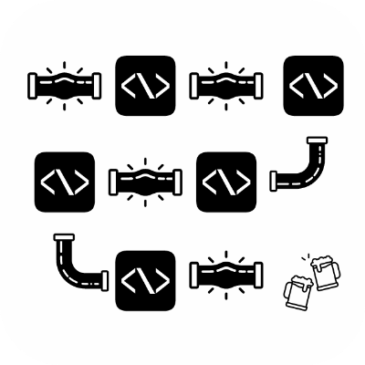

   

<p align="center">
  
</p>

# Middlemen 🔗

A dead simple middleware solution for [Azure Functions](https://azure.microsoft.com/en-us/services/functions/), similar to
[express](http://expressjs.com/), & [hapi](https://hapijs.com/). Which allows you to stop worrying about validation, and token checking, and just worry about business logic.

## Installation

#### Yarn

`yarn add middlemen`

#### NPM

`npm install -S middlemen`

## Usage

Similar to functional programming, the only thing you need to do is attach handlers to the Middlemen in the order you want them to be ran.

```js
// index.js
const { AzureMiddleMen } = require('middlemen');
const JoiSchema = require('./validation');

const wrappedFunc = new AzureMiddleMen()
	.validate(JoiSchema)
	.use((context, req) => /* Check Token or whatever validation. */)
	.use((context, req) => /* Do your business logic here. */)
	.catch((err, ctx) => {
      // Do whatever you want to clean up your function then return an error
		ctx.res = { status: 500, body: err.message };
		ctx.done(null);
	})
	.listen(); // Get ready to listen

module.exports = wrappedFunc;
```

## Motivation

Building a Microservice archtecture is easy.. But repetitive. Sure you might make a function that for instance, returns a user from your database. Only to be bogged down by things like validating that the request is valid, checking JWT tokens, or anything in between.

I have always been enamored with [express](http://expressjs.com/), & [hapi](https://hapijs.com/) because you can do exactly that, focus on your actual code logic, leave the validation to a pipeline and keep your code clean.

## API

### `.use(context, req)`

The typical Azure function with params of `(context, req)` that gets passed along with each function.
The order which handlers are added to the handler determines the order in which they'll be executed in the runtime.

If one stage fails, either by returning or throwing an `Error` the following stages after are not called and all execution is stopped.

```javascript
const wrappedFunc = new AzureMiddleMen()
   .use(JWT.checkToken)
   .use((context,req)) => /* Do some business logic here*/)
   .use((context,req)) => /* Send a confirmation email to user */)
	.listen();

module.exports = ChainedFunction;
```

#### Flow

Unlike most middlware functions, there is no need to call a `next()` function. When your function is done executing, the next function in the flow is called until you call `context.done()`

##### `async/await`

This is fully supported to use `async/await` in all your functions. The pipeline awaits each function naturally.

#### `.validate()`

Validate a [Joi](https://github.com/hapijs/joi) object to be called before any of your `.use` functions. If it fails, it exits the execution and returns a Joi error.

```javascript
const wrappedFunc = new AzureMiddlemen()
	.validate(JoiSchema)
	.use(context => {
		context.res = {
			status: 200,
			body: `I'm called because I passed validation`
		};
		context.done();
	})
	.listen();
```

On a validation failure you'll get a message like this

```
Invalid input, child "email" fails because ["email" is required]
```

### `.catch()`

You can define your own catch function to handle your own errors should they be thrown or returned in any of your functions in the chain.

For example:

```javascript
const wrappedFunc = new AzureMiddlemen()
	.validate(schema)
	.use(() => Error('This is an error'))
	/* OR */
	.use(() => {
		throw Error('This is also an error');
	})
	.catch((err, context) => {
		context.log.error(err);
		context.done(err);
	})
	.listen();
```

Optionally, errors are caught for you automatically in the form of returning the error like so

```js
context.res = {
	status: 400,
	body: { error: error.toString() }
};
context.done();
```

### .listen()

Use at the end of your function chain, just wraps your functions in the middleware to be exported as an Azure Function module.

```javascript
const wrappedFunc = new AzureMiddlemen()
	.use(() => /* Do stuff. */)
	.listen(); // <-- Signal ready
```
